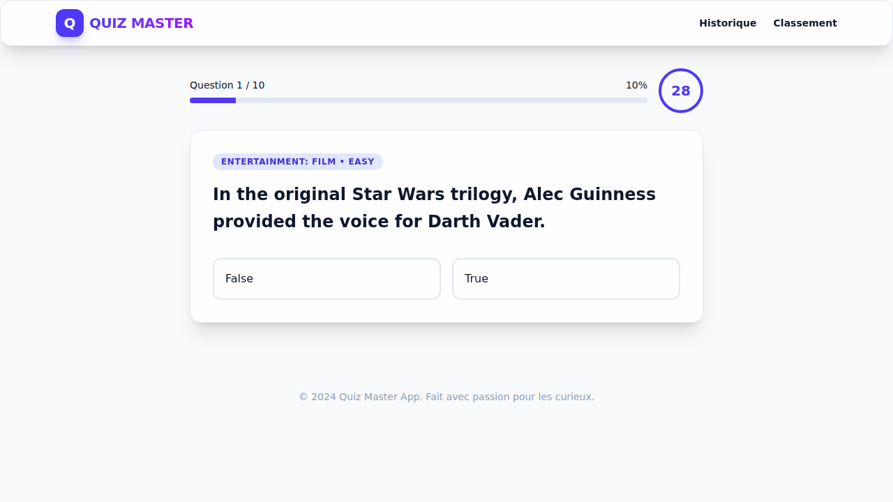
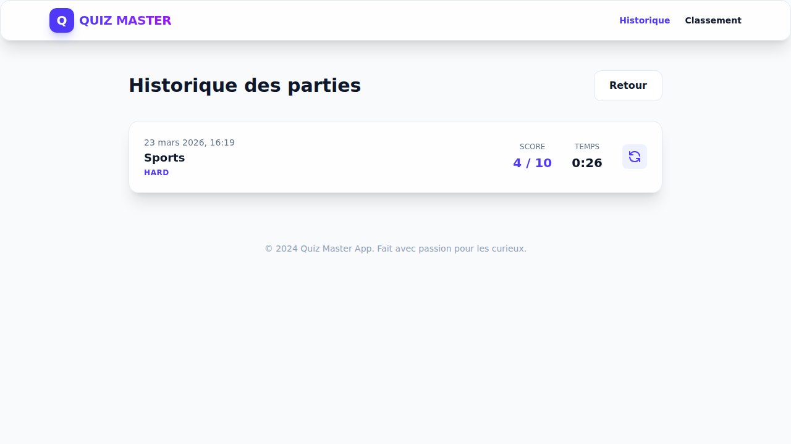

# 🏆 Quiz Master App

Une application de quiz moderne, fluide et complète construite avec **Vue 3**, **Pinia** et **TailwindCSS**.

## ✨ Fonctionnalités

- 🎮 **Système de Quiz Dynamique** : Questions récupérées depuis l'Open Trivia DB.
- ⚙️ **Configurable** : Choisissez votre catégorie, difficulté et nombre de questions.
- ⏱️ **Timer Intégré** : 30 secondes par question pour pimenter le jeu.
- 📊 **Tableau de Bord des Résultats** : Analyse détaillée de votre score avec feedback personnalisé.
- 🏆 **Classement (Leaderboard)** : Suivez les 10 meilleurs scores persistés localement.
- 📜 **Historique Complet** : Liste de toutes vos parties passées avec option "Rejouer Similaire".
- 🎨 **Design Moderne** : Interface "Glassmorphism", transitions fluides et mode sombre natif.
- 📱 **Responsive** : Optimisé pour mobile, tablette et desktop.

## 🚀 Stack Technique

- **Vue 3** (Composition API, `<script setup>`)
- **Vite** (Build tool ultra-rapide)
- **Pinia** (Gestion d'état globale)
- **Vue Router 4** (Navigation fluide)
- **Axios** (Requêtes API)
- **TailwindCSS 4** (Design système moderne)
- **TypeScript** (Code robuste et typé)

## 🎬 Présentation Vidéo

Vous pouvez trouver une démonstration complète du parcours utilisateur ici : [Démonstration Vidéo](./docs/presentation.webm)

## 📸 Aperçu

### Accueil & Configuration


### Interface de Jeu


### Résultats & Performance


### Historique des Parties


## 🛠️ Installation et Lancement

1.  **Installer les dépendances** :
    ```bash
    npm install
    ```

2.  **Lancer en mode développement** :
    ```bash
    npm run dev
    ```

3.  **Lancer le build de production** :
    ```bash
    npm run build
    ```

4.  **Prévisualiser le build** :
    ```bash
    npm run preview
    ```

## 🏗️ Architecture du Projet

```text
src/
├── assets/       # Styles globaux et images
├── components/   # Composants réutilisables (Skeletons, etc.)
├── router/       # Configuration de Vue Router
├── services/     # Appels API (Axios)
├── stores/       # Gestion d'état (Pinia)
├── types/        # Interfaces TypeScript
└── views/        # Pages de l'application
```

---

Fait avec ❤️ pour les amateurs de défis.
