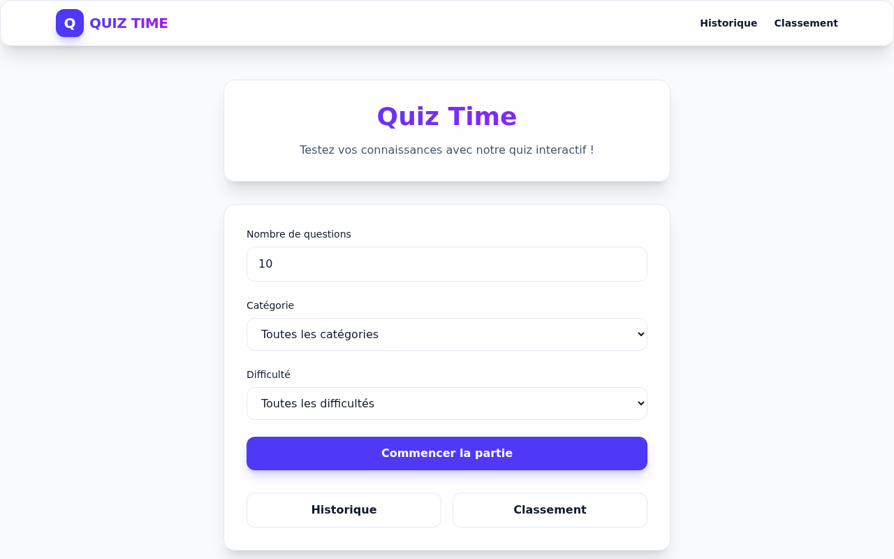
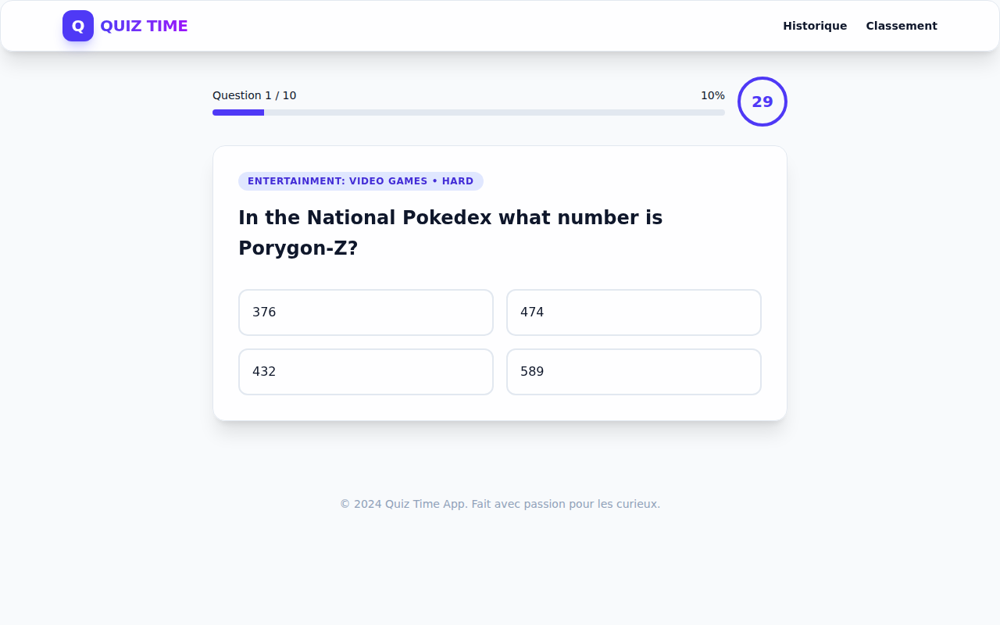
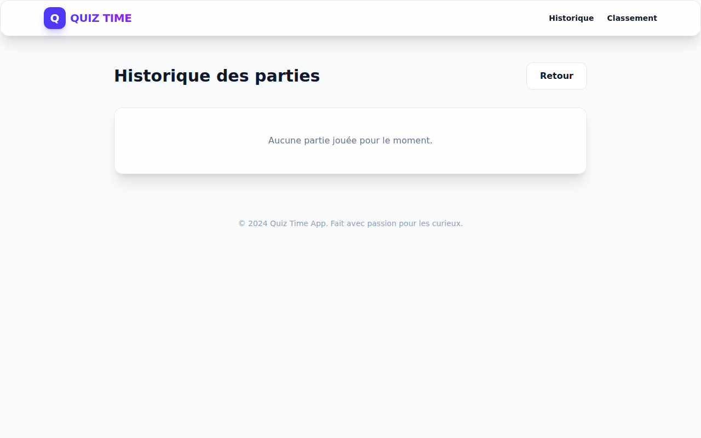
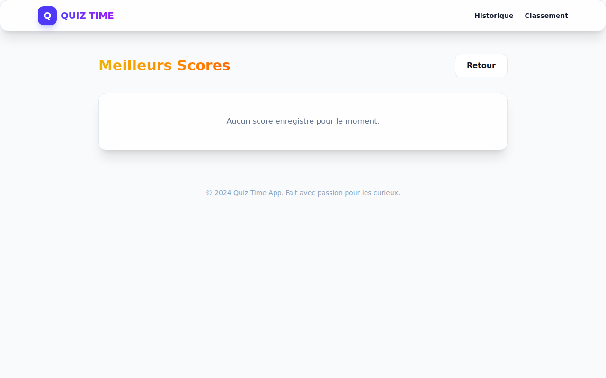
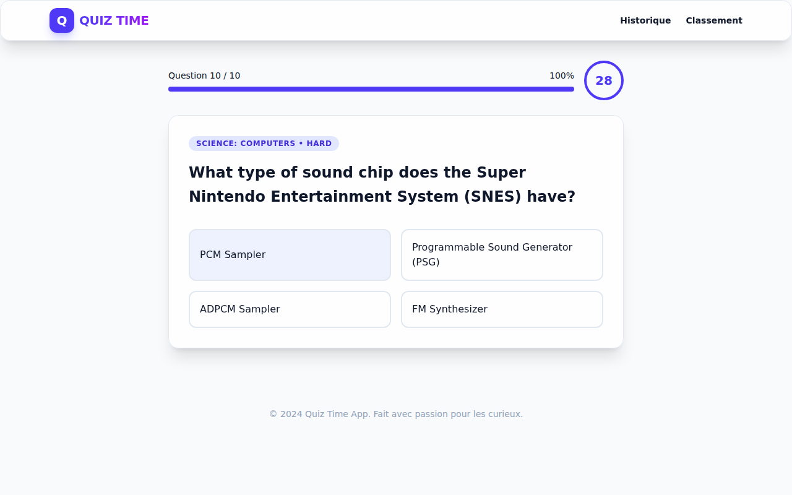

# 🧠 Quiz Time - Interactive Trivia App


Quiz Time is a modern, responsive trivia application built with **Vue 3**, **TypeScript**, and **Tailwind CSS v4**. It leverages the **Open Trivia DB API** to provide thousands of questions across various categories and difficulty levels.

## ✨ Features

- 🎯 **Customizable Quizzes**: Choose the number of questions, categories, and difficulty.
- ⏱️ **Real-time Timer**: 30 seconds per question to keep you on your toes!
- 📊 **Dynamic Progress**: Visual feedback on your progress throughout the quiz.
- 🏆 **Leaderboard**: Track top scores and see how you rank against others.
- 📜 **Quiz History**: Review your past performances and improve over time.
- 🌗 **Responsive Design**: A sleek, "glassmorphism" UI that works perfectly on desktop and mobile.
- 💾 **Local Persistence**: Your scores and history are saved locally using `localStorage`.

## 📸 Preview

### Home Page


### Quiz Interface


### Quiz History


### Leaderboard


### Results


## 🛠️ Tech Stack

- **Frontend Framework**: [Vue 3](https://vuejs.org/) (Composition API)
- **State Management**: [Pinia](https://pinia.vuejs.org/)
- **Styling**: [Tailwind CSS v4](https://tailwindcss.com/)
- **Routing**: [Vue Router](https://router.vuejs.org/)
- **HTTP Client**: [Axios](https://axios-http.com/)
- **Build Tool**: [Vite](https://vitejs.dev/)
- **Language**: [TypeScript](https://www.typescriptlang.org/)
- **API**: [Open Trivia DB](https://opentdb.com/)

## 🚀 Getting Started

### Prerequisites

- [Node.js](https://nodejs.org/) (v18 or higher)
- [npm](https://www.npmjs.com/)

### Installation

1. Clone the repository:
   ```bash
   git clone https://github.com/your-username/quiz-time.git
   cd quiz-time
   ```

2. Install dependencies:
   ```bash
   npm install
   ```

3. Start the development server:
   ```bash
   npm run dev
   ```

4. Build for production:
   ```bash
   npm run build
   ```

## 📂 Project Structure

```text
src/
├── assets/         # Images, icons, and global styles
├── components/     # Reusable Vue components
├── router/         # Vue Router configuration
├── services/       # API integration (Axios)
├── stores/         # Pinia state management
├── types/          # TypeScript interfaces/types
└── views/          # Page components
```

## 📝 License

This project is open-source and available under the [MIT License](LICENSE).

---
Made with ❤️ by [Your Name/Github Handle]
